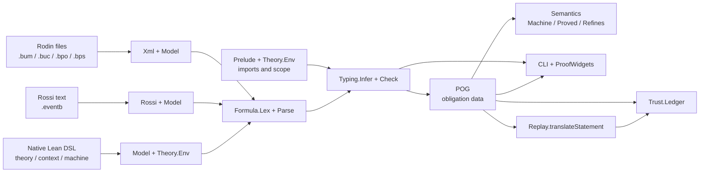
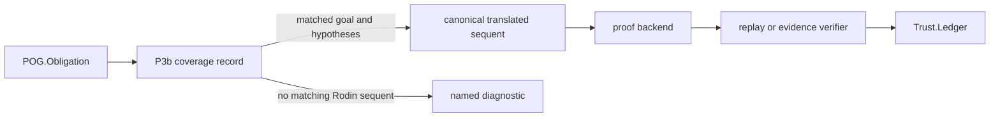
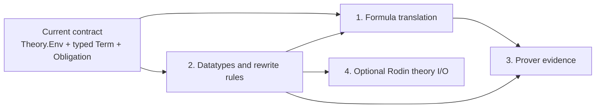

# Architecture

This note describes the public architecture of `eventb-lean`. It is deliberately
about the implementation in this repository, not about the private book export or
its images. Those files are local research inputs and are not distribution artifacts.

## Purpose and boundary

`eventb-lean` is a native Lean 4 Event-B environment with three input paths:

- Rodin model files are read for compatibility and corpus-based validation.
- Rossi `.eventb` text files are read for compatibility with the modern text workflow.
- Event-B models and theories can be authored directly in Lean.

All paths produce the same internal model representation. The typechecker and proof
obligation generator therefore do not care where a model came from. Rodin is an input
format and a source of comparison data, while Rossi is an authoring/LSP workflow;
neither is a runtime dependency.

The project has three intentionally separate concerns:

1. syntax and model data: read, parse, and retain Event-B structures;
2. analysis: resolve scopes, infer types, and generate obligations;
3. proof and reporting: state semantic results, classify trust, and present them.

## Data flow



The `.bpo` and `.bps` files are comparison data rather than inputs to the native
pipeline. They provide the type and proof-status answers used by the gates.

### Rossi text boundary

`EventB.Rossi` accepts one or more `CONTEXT`/`MACHINE` components per `.eventb` file,
including compact and multiline input, comments, component references, labels,
theorems, variants, event statuses, witnesses, refinements, and Rossi's ASCII formula
aliases. A directory may contain `.eventb` files alongside Rodin `.bum`/`.buc` files;
the CLI resolves component references by declared component name, not filename stem.

The structural reader lowers into `Elem` and leaves formula strings for the shared
lexer/parser. It reports malformed structure with source line numbers and only joins
lines inside a recognized structural section. Formula/action boundaries and the
differential compatibility matrix are implemented for the supported reader subset.
The mathematical token and precedence target is the
[Event-B Mathematical Language specification][kernel-lang]; Rossi's project grammar
remains the authority for `.eventb` component structure.

[kernel-lang]: https://web-archive.southampton.ac.uk/deploy-eprints.ecs.soton.ac.uk/11/4/kernel_lang.pdf

## Layers

| Layer | Main modules | Responsibility |
| --- | --- | --- |
| XML and model | `EventB.Xml`, `EventB.Model` | Lossless XML reader and Event-B tree. |
| Rossi text | `EventB.Rossi` | Plain-text `.eventb` reader lowered to the Event-B tree. |
| Formula language | `EventB.Formula.Lex`, `Parse` | Parse and print Rodin formula terms. |
| Prelude | `EventB.Prelude` | Core symbols, application, and definedness metadata. |
| Theories | `EventB.Theory`, `Theory.Validate`, `Theory.Embed` | User theories, validation, and Lean denotations. |
| Typing | `EventB.Typing.Type`, `Infer`, `Check` | Infer types and validate component scope. |
| POG | `EventB.POG` | Generate named obligations, goals, and hypotheses. |
| Semantics | `EventB.Semantics` | Machines, reachability, proof, and refinement soundness. |
| Trust and embedding | `EventB.Trust`, `Trust.Replay`, `Trust.Rodin`, `Embedding`, `Formula.Translate` | Proof provenance, status import, and kernel translation. |
| Front ends | `EventB.DSL`, `Widgets.lean`, `Main.lean` | Author, check, and display models. |

## Native theories

`EventB.Prelude.core` is present in every `Theory.Env`. A user theory is a `Spec` with
a name, imports, and a list of `Prelude.Symbol` values. `Theory.add` validates it before
registration:

- duplicate theory and symbol names are rejected;
- core names cannot be redefined;
- unknown imports are rejected;
- ambiguous imported names are rejected;
- a local symbol cannot shadow an imported symbol.

The DSL exposes this as:

```lean
eventb_theory Bounds where
  constant LIMIT : ℤ
  predicate below_limit

eventb_theory Controls where
  imports Bounds
  constant OPEN : BOOL
  predicate active : ℤ → BOOL
  expression clamp : ℤ → ℤ
```

The `uses` clause on a context or machine records its theory roots. The checker
collects roots through the component closure, while `Theory.lookupIn?` resolves only
the core prelude and those roots and their imports. A symbol in an unrelated theory is
therefore not visible merely because it was declared somewhere in the Lean module.

The same scope is used by native formula elaboration, `Typing.inferComponentIn`, and
`POG.generateIn`. This is important: scope is a property of the model component, not a
global parser setting.

## Formula and typing pipeline

Rodin formulas remain strings until `Formula.parse` turns them into `Term` values. The
native DSL uses ordinary Lean terms where the notation is compatible and retains
quoted strings for Event-B operators that Lean syntax cannot express directly.

`Typing.Check` first walks the component closure: contexts, refinement parents, and
the current component. It then adds carriers, constants, variables, event parameters,
and predicates to the inference state. `Typing.Infer.St` carries both the inferred
environment and the active theory roots. An unknown identifier is an error; it is not
silently treated as a fresh type variable.

Native declarations also register source ranges. The Lean server can use those ranges
for Go to Definition on unquoted theory symbols and model identifiers. Quoted formulas
remain useful for compatibility, but cannot provide the same identifier navigation.

Every symbol also carries a stable `SymbolId`, its declared type when applicable,
documentation, and a `SourceRange`. Theory symbols are canonicalized to
`TheoryName::symbol`; core symbols use the `EventB.Core` owner. Native theory
declarations may bind explicit type parameters. Their embedding requires a Lean type
instantiation, so a polymorphic declaration cannot silently fall back to an untyped
placeholder.

## Obligation generation

`POG.generateIn theory project machine` is the theory-aware entry point. It produces
`POG.Obligation` records containing a Rodin-compatible name, obligation class, and,
where derived, a goal and ordered hypotheses. The compatibility `POG.generate` entry
point uses an empty user-theory environment for corpus models that do not use native
theories.

Well-definedness is driven by symbol metadata in the prelude and theory environment.
Total operators do not produce unnecessary WD conditions; conditional operators carry
the definedness facts they require. A user-defined predicate or expression therefore
uses the same POG path as a core symbol.

Generating an obligation is not the same as proving it. The obligation data is the
boundary between analysis and proof. `EventB.Semantics` supplies the kernel-native
machine, invariant, and refinement propositions; later proof backends can attach
evidence without changing the model checker.

Theory validation also emits declaration obligations. Structural rewrite termination is
marked `checked` only for the conservative decreasing case; rewrite soundness and
inference/theorem soundness remain `open` until a proof is supplied. `Theory.Embed`
retains these obligations beside each translated rule proposition, so a caller can
attach proof evidence without confusing translation with proof. Axiomatic definitions
are marked `assumed`. These statuses are data, not hidden axioms.

## Trust ledger

`EventB.Trust.Ledger` gives every generated obligation an explicit mode. New
obligations start as `unproved`; later integrations may classify evidence as:

- `kernel`: checked by Lean's kernel;
- `smt`: accepted through an SMT trust boundary;
- `rodinImported`: imported from Rodin's recorded result;
- `external`: accepted from another external prover;
- `unproved`: no accepted evidence yet.

The ledger is intentionally separate from `POG.Obligation`. A generator must not imply
that a generated proposition has already been discharged.

`Trust.Replay.translateStatement` is the reusable translation backend for a complete
goal-plus-hypotheses sequent. It does not change the ledger. `Trust.Replay` accepts a
kernel proof only after resolving its declaration, translating the complete POG sequent,
checking definitional equality, and comparing its transitive axiom dependencies with
the declared metadata. `Trust.Rodin` imports `.bps` status
records as `rodinImported`; it never upgrades them to kernel evidence. SMT and external
evidence remain explicit metadata boundaries and must carry solver/tool, version, input
digest, and verifier fields.

## User experience

There are two presentation paths:

- the CLI and gates provide reproducible text output and corpus comparisons;
- ProofWidgets show component declarations, native theory scope, obligation counts,
  hypotheses, goals, and trust summaries in the Lean Infoview.

The widget layer calls the same `Typing` and `POG` functions as the CLI. It is a view,
not a second checker, so presentation changes cannot alter generated obligations.

The corpus gate also exposes `lake exe gates --coverage`. It emits stable tab-separated
records with component, obligation class, name, derivation status, reason, and a
diagnostic. Reasons are `matched`, `no-sequent`, `goal-differs`, or
`hypotheses-differ`; missing targets are further classified as pinned-`.bpo` omissions
of plain type invariants, definedness, refinement guards/actions, or witness
feasibility. A missing Rodin target therefore remains visible instead of shrinking a
denominator. WFIS and WWD records with no generated goal retain `not-derived` status;
WWD is explicitly labelled `hypothesis-only` in CLI JSON and widgets.

`lake exe eventb report <project-or-eventb>` emits one machine-readable JSON object for
the same project. Each obligation includes its P3 name-coverage status (when `.bpo`
files are present), derived/hypothesis-only status, local proof rule, trust mode, goal,
and canonical fingerprint; the top-level `trust_ledger` counts each mode separately.
For a Rossi-only file the coverage source is explicitly `none`, rather than implying
Rodin parity. `lake exe gates --histogram` additionally groups unproved P4 records by
formula shape before a new kernel rule is attempted.

## Verification contract

The repository's executable contract is:

```sh
lake build
lake build Examples
lake exe gates
pre-commit run --all-files
```

The gates compare the implementation against the pinned corpus and ratchet files:

- P0: all 38 source files are read;
- P1: 1102 formula strings parse and round-trip;
- P2: 940 distinct inferred types match;
- P3: generated obligation names are compared with Rodin;
- P3b: 1129 of 1322 comparable goals and hypothesis sets are derived; 193 generated
  targets have no matching `.bpo` sequent and remain explicit coverage data with
  diagnostics. The 103 plain type-invariant omissions are a selective pinned-corpus
  compatibility difference; broad filtering is unsound because the corpus retains
  other static-looking invariant sequents.
  Seven additional WFIS names are also recorded as name-only coverage when Rodin does
  not serialize a target predicate, for 200 pinned compatibility records in total;
- P4: the gates run the deterministic local baseline over the 1133 P3-matched
  obligations; the current result is 73 external-trusted and the rest unproved.

The semantic boundary is explicit: theory definitions and constructors require
caller-supplied Lean denotations; translation can be measured independently; only a
replayed Lean proof can produce kernel evidence. The complete v2 audit repeats all four
commands above and the executable examples, including native theory and Rodin theory
round-trip checks.

Every focused commit is expected to leave these checks green. `STATUS.md` is generated;
`TODO.md` records the production-readiness execution ledger and deliberate ceilings.

## Next-version architecture: precision before proof

The v2 release establishes the complete shared pipeline. The next version has two
ordered workstreams, because proving an obligation that should not have been generated
is worse than leaving it visibly unproved:



### P3b precision boundary

`EventB.POG` remains the only obligation generator. It must emit the same named
surface that Rodin emits for the supported corpus, while retaining unsupported or
format-specific cases as data. The gate therefore needs two separate facts for every
record:

1. whether the PO name exists in the `.bpo` corpus;
2. whether the generated goal and ordered hypotheses match the recorded sequent.

The current 193 unmatched records are concentrated in WD, INV, SIM, and GRD, with seven
additional WFIS name-only records. They are
not to be removed by broadening the comparison or by blessing a smaller denominator.
The correction belongs in the shared POG conditions: total versus partial symbols,
assigned-variable filtering, refinement inheritance, witness substitution, and
abstract/concrete event matching. WFIS is derived when Rodin supplies its existential
target. WWD remains hypothesis-only when Rodin supplies no target predicate, and that
fact is reported explicitly in CLI, JSON, widgets, and the ratchet.

### P4 proof boundary

Only obligations that have passed the P3b comparison enter the proof-coverage path.
The canonical input contains the model scope, resolved theory roots, normalized
hypotheses, goal, and formula-language version. Display labels and source ranges do
not affect its fingerprint; a semantic change does. `Trust.Replay.translateStatement`
is the single translated-sequent path, and missing semantic bindings remain actionable
translation errors rather than opaque constants.

Backends are ordered by trust strength, not by convenience:

- kernel replay constructs or checks a Lean proof term and is the only route to
  `kernel` evidence;
- SMT and other external tools return explicit metadata, digests, and verifier
  identity and remain `smt` or `external` evidence;
- `.bps` status is imported as `rodinImported`, never upgraded to kernel evidence;
- missing or stale evidence remains `unproved`.

The current local rules are a measurement baseline, not the final prover. Kernel-backed
proof-term construction now covers exact-hypothesis, truth, reflexivity, contradiction,
positive closed numeral inequalities, conjunction introduction, implication
introduction, and conjunction projection in `EventB.Prover.Kernel`; standard axiom
dependencies are declared to `Trust.Replay.validateTerm` rather than hidden. Replay
checks each term against the translated sequent. The external local backend remains a
comparator. Further arithmetic, set, relation, theory, and refinement rules are added
only when each has a negative regression and replayable evidence.

### Version 3 definition of done

Version 3 is complete when every P3b mismatch is an explained, regression-tested
diagnostic, every discharged P4 result has an explicit trust mode and replay or
verifier path, and all remaining obligations are visibly unproved. The current corpus
ceiling is pinned-artifact compatibility, not an unreported failure. The existing
model, scope, formula AST, POG obligation type, and trust ledger remain the single
representations; no backend or front end may create a second checker.

## Rossi compatibility and project input

This is an input compatibility layer, not a second general-purpose Event-B editor.
Rossi owns the modern text/LSP authoring workflow; `eventb-lean` independently checks
the resulting model, reconstructs obligations, and records what is trusted. This keeps
the project useful even when Rossi or Rodin is not present at proof/review time.

- [x] Read Rossi `.eventb` components into the shared `Elem` representation.
- [x] Load a `.eventb` file or a directory of `.eventb`/Rodin source files in the CLI.
- [x] Preserve component names, labels, theorem flags, event status, witnesses,
  refinement links, variants, and enumerated-set source metadata.
- [x] Cover compact input, comments, multiline labels, and the published Rossi examples.
- [x] Make formula and action boundaries token-aware for wrapped formulas and adjacent
  unlabelled actions in the supported reader subset.
- [x] Add a differential compatibility matrix against Rossi parser fixtures.
- [x] Align the supported lexing, reserved words, whitespace, and precedence subset
  with the kernel-language specification; unsupported constructs remain diagnostics.

## Implemented roadmap

The current implementation has the syntax, scoped environment, typechecker, POG, trust
ledger, and Lean embedding. The completed workstreams are:



Every workstream must consume the existing model and scope contracts. None may create
a second parser, environment, or obligation representation.

### 1. Full formula translation

`EventB.Embedding` maps resolved types to Lean types, and `Formula.Translate` maps
resolved `Formula.Term` values to kernel-checked Lean expressions. The translator covers
the structural language already accepted by the parser and checker:

- integers, Booleans, carrier sets, products, powersets, relations, and maplets;
- arithmetic, equality, membership, subset, relation, set, and Boolean operators;
- quantified and set-builder binders with correct variable capture;
- primed variables and the expression forms used by assignments;
- core and native-theory symbols after scoped resolution;
- explicit semantic bindings for partial or theory-specific operators such as `card`,
  `min`, and `max`.

The translator should take typed, resolved terms and return either a typed Lean target
or a diagnostic identifying the unsupported term and its source range. It must not
interpret an unresolved identifier as an arbitrary Lean constant, and it must not erase
well-definedness conditions while producing a convenient expression.

Ordinary model and theory symbols must have explicit Lean denotations. A visible symbol
without one is a diagnostic, not an opaque constant. The translation boundary remains
separate from parsing and inference:

1. `Formula.Parse` produces syntax;
2. `Typing` resolves identifiers and types them in component scope;
3. `Embedding` translates the resolved term;
4. `Semantics` and proof backends consume the translated proposition.

Acceptance criteria:

- translated terms have the same type as the `Typing` result;
- representative native models produce kernel-checkable Lean propositions;
- generated POs can expose a translated goal and translated hypotheses;
- binders, primed variables, partial operators, and unsupported syntax have negative
  tests;
- all existing corpus gates remain unchanged and green.

### 2. Datatypes, definitions, and rewrite rules

`Theory.Spec` contains typed datatypes, definitions, rewrite rules, inference rules, and
theorems. `Theory.Validate` checks their scope, types, declaration shape, and the
conservative structural orientation required for rewrite rules. `Theory.Embed` turns
checked definitions and rules into Lean expressions and checks explicit Lean datatype
and constructor denotations.

The extension should be conservative:

- datatypes have explicit constructors, argument types, and a scoped identity;
- definitions record their defining term rather than silently becoming axioms;
- rewrite rules have typed left and right sides and an explicit orientation;
- inference and theorem rules declare premises, conclusion, type variables, and scope;
- axiomatic assumptions remain visible in the trust ledger and never become kernel
  theorems merely because they were imported;
- imported declarations use the same duplicate, ambiguity, and shadowing checks as
  current symbols.

Rewriting is a proof transformation, not a string replacement. The implementation
must either check a terminating orientation or require a proof/certificate for the
rule system it applies. A rule that cannot be justified is reported as an assumption,
not applied as if it were definitional equality.

Acceptance criteria:

- native declarations elaborate to the same scoped `Theory.Env` used by models;
- constructor and rule applications are type-checked before POG or translation;
- definitions and rules generate any required well-definedness or soundness goals;
- polymorphic instantiation is explicit enough to audit in an obligation;
- a negative test rejects an ill-typed, cyclic, ambiguous, or out-of-scope rule;
- theory examples exercise imported datatypes and rules through widgets and CLI output.

Datatype elaboration intentionally does not invent an inductive declaration in the
user's Lean namespace. The caller supplies the Lean type and constructor expressions;
the adapter checks their types against the Event-B declaration. This keeps ownership of
the Lean namespace explicit while still making the embedding kernel-checkable.

### 3. Prover evidence and trust

The ledger distinguishes `kernel`, `smt`, `rodinImported`, `external`, and `unproved`.
Generated obligations still start as unproved entries. The evidence pipeline is:

```text
POG.Obligation
    -> canonical statement and fingerprint
    -> prover backend
    -> evidence verifier or replay step
    -> Trust.Entry with mode, evidence, and tool metadata
    -> CLI and ProofWidgets
```

Evidence must be tied to a canonical obligation statement, the relevant theory/model
environment, and the prover configuration. A stale or forged result must not silently
move an obligation out of `unproved`. In particular:

- a Lean proof term is accepted only after kernel replay;
- an SMT result records its solver, version, input digest, and trust mode;
- an external proof records the verifier and evidence location;
- an imported Rodin result is labelled `rodinImported`, never `kernel`;
- missing, stale, or unverifiable evidence leaves the entry `unproved`.

`Trust.Rodin` compares a component's obligations with Rodin's recorded `.bps` statuses
and can attach a matching status as `rodinImported`. Matching Rodin's discharge count is
useful evidence about coverage; it is not evidence that Lean checked the same proof.
The generated corpus status report keeps imported Rodin status separate from local
evidence. The local backend only classifies results it can verify deterministically;
the rest remain unproved. Its current 73/1133 result is a baseline, not a claim of
kernel proof coverage.

Acceptance criteria:

- every accepted result has a stable obligation fingerprint and explicit mode;
- evidence can be replayed or rejected in a clean build;
- changing the obligation, model, theory, or prover input invalidates the evidence;
- the widget shows the obligation's mode and evidence status without conflating them;
- negative tests prove that unverifiable and mislabelled evidence is rejected;
- P4 records discharge results without weakening P0 through P3b.

### 4. Optional Rodin theory I/O

Native theory authoring remains the source of truth. Rodin theory import/export is an
adapter for migration and interoperability, not a dependency of the checker, POG, or
proof pipeline. It should be implemented only after the native declaration schema and
translation boundary are stable.

The adapter provides a strict, dependency-free supported subset:

- import from the Rodin theory-file format into validated `Theory.Spec` declarations;
- export of supported native declarations with stable names, types, imports, and rules;
- explicit diagnostics for constructs with no faithful native representation;
- deterministic round-tripping for supported symbols, datatypes, definitions, parameters,
  rewrite/inference/theorem rules, and imports;
- dependency loading that validates imports before exposing a theory to a component.

Import must not bypass `Theory.add`, and export must not serialize declarations that
were accepted only under an unrecorded trust assumption. Unknown extension data is
rejected rather than silently discarded; full `.tuf` extension preservation remains a
separate compatibility task. The optional adapter does not require Rodin to be installed
or running.

Acceptance criteria:

- minimal public fixtures import into the native environment and pass scope/type checks;
- supported declarations round-trip without changing their resolved meaning;
- unsupported declarations fail with declaration paths and actionable diagnostics;
- imported assumptions and proof status retain their trust classification;
- disabling the adapter leaves native authoring, gates, and widgets unaffected.

### Execution order and definition of done

The practical order is:

1. stabilize resolved symbol identities, source ranges, and typed term contracts;
2. complete translation for the current Event-B language;
3. extend theories with datatypes, definitions, and justified rules;
4. attach replayable prover evidence to generated obligations;
5. add Rodin theory I/O as an optional compatibility package.

Evidence work can begin with the current POG records, but its feature-complete form
depends on canonical translated goals. Rodin I/O intentionally comes last so its file
format cannot dictate the native theory design.

Each milestone is complete only when it has native examples, negative tests, explicit
diagnostics, and updated trust reporting, while `lake build`, `lake exe gates`, and
`pre-commit run --all-files` remain green. Unsupported constructs stay data with a visible
diagnostic; they never become `sorry`, an implicit axiom, or an unrelated identifier.

The roadmap boundaries are implemented and covered by native examples, negative checks,
project/theory loading commands, LSP range checks, and the existing build/gate contract.
The production-readiness work is tracked in `TODO.md`; it must preserve the single-model
invariant and the explicit trust boundary described above.
The architecture invariant remains: one model, one scope, one analysis pipeline, and
separate presentation and proof integrations.

## Tracing one symbol

For `LIMIT` in `cars < LIMIT`:

1. `eventb_theory Bounds` creates a constant symbol with type `ℤ`.
2. `Controls` imports `Bounds`, and a component declares `uses Controls`.
3. Formula parsing produces an identifier term for `LIMIT`.
4. scoped typing resolves `LIMIT` through `Controls` and its imports.
5. POG uses the resolved environment when deciding goals and WD conditions.
6. The widget and trust ledger report the result without changing it.

This is the intended invariant for future features: one model, one scope, one analysis
pipeline, many presentation and proof integrations.
