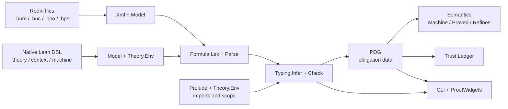

# Architecture

This note describes the public architecture of `eventb-lean`. It is deliberately
about the implementation in this repository, not about the private book export or
its images. Those files are local research inputs and are not distribution artifacts.

## Purpose and boundary

`eventb-lean` is a native Lean 4 Event-B environment with two input paths:

- Rodin model files are read for compatibility and corpus-based validation.
- Event-B models and theories can be authored directly in Lean.

Both paths produce the same internal model representation. The typechecker and proof
obligation generator therefore do not care where a model came from. Rodin is an input
format and a source of comparison data, not a runtime dependency.

The project has three intentionally separate concerns:

1. syntax and model data: read, parse, and retain Event-B structures;
2. analysis: resolve scopes, infer types, and generate obligations;
3. proof and reporting: state semantic results, classify trust, and present them.

## Data flow



The `.bpo` and `.bps` files are comparison data rather than inputs to the native
pipeline. They provide the type and proof-status answers used by the gates.

## Layers

| Layer | Main modules | Responsibility |
| --- | --- | --- |
| XML and model | `EventB.Xml`, `EventB.Model` | Lossless XML reader and Event-B tree. |
| Formula language | `EventB.Formula.Lex`, `Parse` | Parse and print Rodin formula terms. |
| Prelude | `EventB.Prelude` | Core symbols, application, and definedness metadata. |
| Theories | `EventB.Theory` | User theories, imports, symbols, and scoped lookup. |
| Typing | `EventB.Typing.Type`, `Infer`, `Check` | Infer types and validate component scope. |
| POG | `EventB.POG` | Generate named obligations, goals, and hypotheses. |
| Semantics | `EventB.Semantics` | Machines, reachability, proof, and refinement soundness. |
| Trust and embedding | `EventB.Trust`, `EventB.Embedding` | Proof provenance and type mapping. |
| Front ends | `EventB.DSL`, `Widgets.lean`, `Main.lean` | Author, check, and display models. |

## Native theories

`EventB.Prelude.core` is present in every `Theory.Env`. A user theory is a `Spec` with
a name, imports, and a list of `Prelude.Symbol` values. `Theory.add` validates it before
registration:

- duplicate theory and symbol names are rejected;
- core names cannot be redefined;
- unknown imports are rejected;
- ambiguous imported names are rejected;
- a local symbol cannot shadow an imported symbol.

The DSL exposes this as:

```lean
eventb_theory Bounds where
  constant LIMIT : ℤ
  predicate below_limit

eventb_theory Controls where
  imports Bounds
  constant OPEN : BOOL
  predicate active : ℤ → BOOL
  expression clamp : ℤ → ℤ
```

The `uses` clause on a context or machine records its theory roots. The checker
collects roots through the component closure, while `Theory.lookupIn?` resolves only
the core prelude and those roots and their imports. A symbol in an unrelated theory is
therefore not visible merely because it was declared somewhere in the Lean module.

The same scope is used by native formula elaboration, `Typing.inferComponentIn`, and
`POG.generateIn`. This is important: scope is a property of the model component, not a
global parser setting.

## Formula and typing pipeline

Rodin formulas remain strings until `Formula.parse` turns them into `Term` values. The
native DSL uses ordinary Lean terms where the notation is compatible and retains
quoted strings for Event-B operators that Lean syntax cannot express directly.

`Typing.Check` first walks the component closure: contexts, refinement parents, and
the current component. It then adds carriers, constants, variables, event parameters,
and predicates to the inference state. `Typing.Infer.St` carries both the inferred
environment and the active theory roots. An unknown identifier is an error; it is not
silently treated as a fresh type variable.

Native declarations also register source ranges. The Lean server can use those ranges
for Go to Definition on unquoted theory symbols and model identifiers. Quoted formulas
remain useful for compatibility, but cannot provide the same identifier navigation.

## Obligation generation

`POG.generateIn theory project machine` is the theory-aware entry point. It produces
`POG.Obligation` records containing a Rodin-compatible name, obligation class, and,
where derived, a goal and ordered hypotheses. The compatibility `POG.generate` entry
point uses an empty user-theory environment for corpus models that do not use native
theories.

Well-definedness is driven by symbol metadata in the prelude and theory environment.
Total operators do not produce unnecessary WD conditions; conditional operators carry
the definedness facts they require. A user-defined predicate or expression therefore
uses the same POG path as a core symbol.

Generating an obligation is not the same as proving it. The obligation data is the
boundary between analysis and proof. `EventB.Semantics` supplies the kernel-native
machine, invariant, and refinement propositions; later proof backends can attach
evidence without changing the model checker.

## Trust ledger

`EventB.Trust.Ledger` gives every generated obligation an explicit mode. New
obligations start as `unproved`; later integrations may classify evidence as:

- `kernel`: checked by Lean's kernel;
- `smt`: accepted through an SMT trust boundary;
- `rodinImported`: imported from Rodin's recorded result;
- `external`: accepted from another external prover;
- `unproved`: no accepted evidence yet.

The ledger is intentionally separate from `POG.Obligation`. A generator must not imply
that a generated proposition has already been discharged.

## User experience

There are two presentation paths:

- the CLI and gates provide reproducible text output and corpus comparisons;
- ProofWidgets show component declarations, native theory scope, obligation counts,
  hypotheses, goals, and trust summaries in the Lean Infoview.

The widget layer calls the same `Typing` and `POG` functions as the CLI. It is a view,
not a second checker, so presentation changes cannot alter generated obligations.

## Verification contract

The repository's executable contract is:

```sh
lake build
lake build Examples
lake exe gates
python3 scripts/style-check.py
```

The gates compare the implementation against the pinned corpus and ratchet files:

- P0: all 38 source files are read;
- P1: 1102 formula strings parse and round-trip;
- P2: 940 distinct inferred types match;
- P3: generated obligation names are compared with Rodin;
- P3b: derived goals and hypotheses are compared where implemented;
- P4: proof discharge and trust classification remain separate work.

Every focused commit is expected to leave these checks green. `STATUS.md` is generated;
`PLAN.md` records measured progress and the next bounded work item.

## Current extension boundary

The architecture is ready for, but does not claim to complete, the following layers:

- translation of resolved Event-B formulas into executable or theorem-level Lean terms;
- richer theory declarations such as datatypes, rewrite rules, and polymorphic theorems;
- proof backends and evidence import with auditable trust modes;
- optional Rodin theory-file compatibility;
- richer language-server diagnostics and navigation.

These extensions should consume the existing `Theory.Env`, typed `Term` values, and
`POG.Obligation` records. They should not create a parallel model or scope system.

## Tracing one symbol

For `LIMIT` in `cars < LIMIT`:

1. `eventb_theory Bounds` creates a constant symbol with type `ℤ`.
2. `Controls` imports `Bounds`, and a component declares `uses Controls`.
3. Formula parsing produces an identifier term for `LIMIT`.
4. scoped typing resolves `LIMIT` through `Controls` and its imports.
5. POG uses the resolved environment when deciding goals and WD conditions.
6. The widget and trust ledger report the result without changing it.

This is the intended invariant for future features: one model, one scope, one analysis
pipeline, many presentation and proof integrations.
